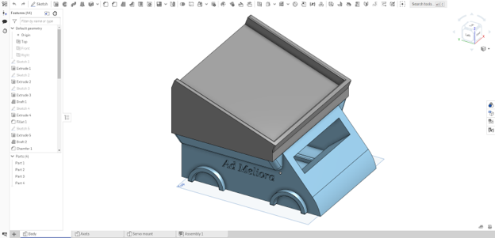
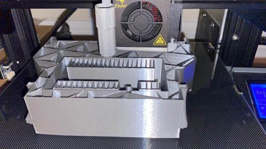
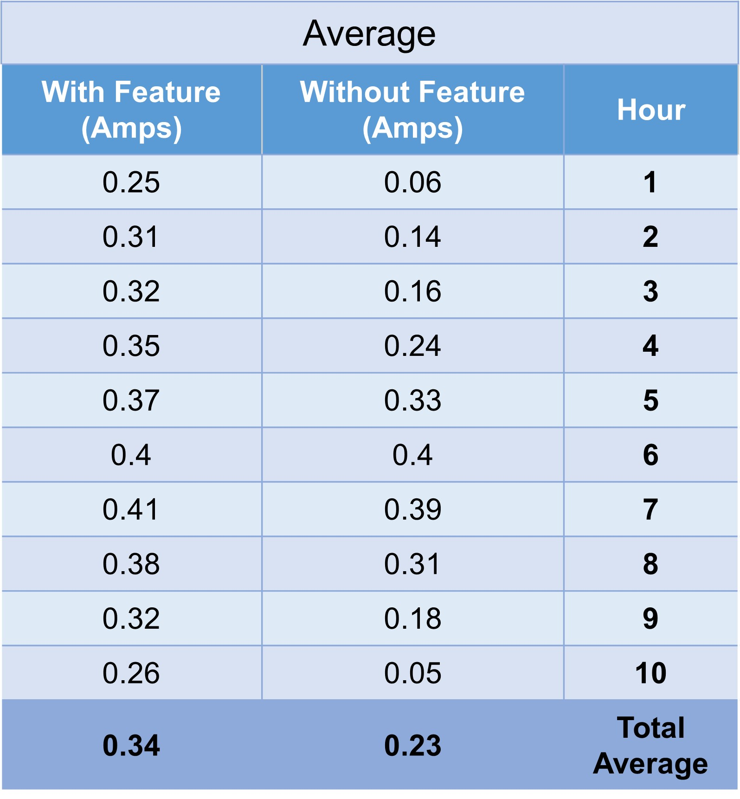
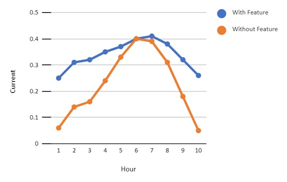

# Autonomous Systems in Space Exploration
## Video Demo  <br><br>[](https://www.youtube.com/watch?v=MYJkZDZIzyw)
## Description

&emsp;&emsp;Rovers have been sent to Mars since 1997, performing tasks such as taking pictures and examining samples. Many solar-powered rovers have limited or nonexistent nocturnal operations like the Sojourner, which is known to not be able to turn or tilt its solar panels. Although rovers in the past pointed towards the equator, the median position to charge, this was simply a heuristic solution to efficient solar charging. This project aims to test a new solution: programming a mock rover to turn towards the Sun as the Sun’s position changes relative to Mars. The overall goal is to prove that continuous direct exposure to the Sun increases battery life and can allow for enhanced nocturnal operations if implemented on real rovers.

&emsp;&emsp;First, the rover was designed using CAD software, and 3D printed. An Arduino Nano Every microcontroller was used to program the rover, along with servo motors to move the rover, and a phototransistor for light sensing. Then, a program was written to test the rover running without the feature, simulating a Mars task by moving back and forth. Finally, a program was written to test the rover with the feature, simultaneously performing the same task.

<p float="left">
  
  
</p>

&emsp;&emsp;The programs were written in Arduino, which was very similar to C programming. To create the task performed by the rover, functions were created to abstract servo commands into simple go(), reverse(), and stopMove() functions, for example, to improve code readability. This made making the forward and backwards task easy, since the go(), delay(), and reverse() functions could easily be called in the main loop.

```c
void loop() {
  // simulate task
  go();
  delay(1000);
  reverse();
  delay(1000);
  stopMove();
}
```

&emsp;&emsp;Next, the autonomous feature for efficient solar charging had to be programmed. In addition to what was programmed previously, the feature was implemented by storing the analog light value in the lightNow variable, and continously monitoring for a significant light value change (above 40 analog values), before making the robot scan again. With each iteration, the task was performed for a fair comparison to the run without the feature.

&emsp;&emsp;For testing the programmed feature, the rover was run from sunrise to sunset. Both instances of the rover were initially placed facing north (a median position), but the rover with the feature was able to turn itself to the brightest light direction. The current in Ampere was recorded each hour using a USB doctor, which reported Ampere and Voltage from the solar panel.

<p float="left">
  
  
</p>

&emsp;&emsp;After testing completed, the average current measured from the rover with the feature was 0.34 Amps (calculated to 2300 mAh), whereas the average current measured from the rover without the feature was 0.23 Amps (calculated to 3400 mAh). This meant that the programmed feature yielded about 48% higher battery capacity. Therefore, it is reasonable to conclude that improving the efficiency of solar power in future Mars exploration could make it viable for data collection in smaller rover missions at lower costs.

## Acknowledgements
What started as a simple project idea transformed into my final cs50 project. This is my special thanks to [Krit Dass](https://github.com/kritdass), who initially proposed this idea and worked with me with the initial stages of this project.
